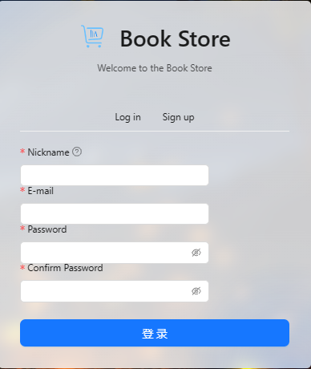
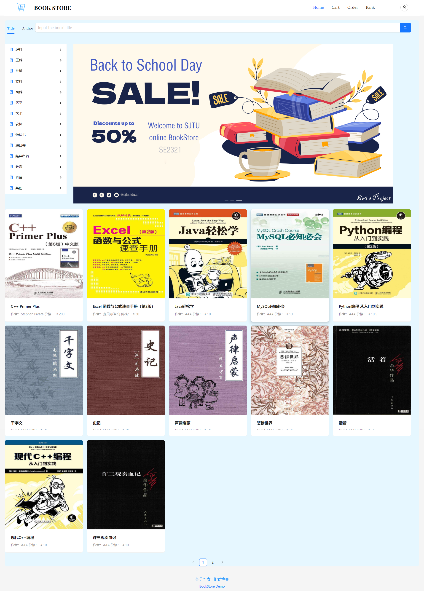
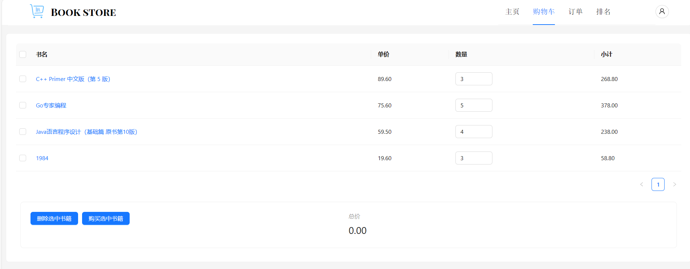
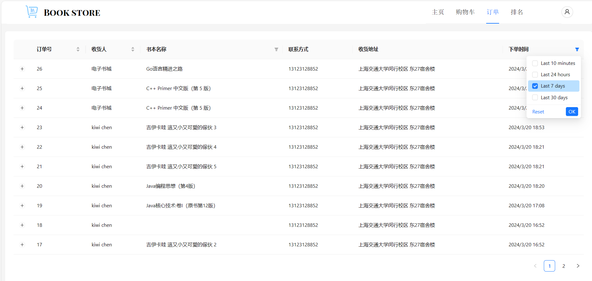

# Book Store Frontend

作者：陈启炜

## 作业7说明

本次作业内容已在作业4中完成。实现登录检查，目前接入自己的后端进行检查。接入后端进行下单。

## 项目结构

``` constructure

D:\bookStore_frontend\bookstore
├── developMD.md
├── package-lock.json
├── package.json
├── public
├── README.md
└── src 
    ├── App.css
    ├── App.js
    ├── App.test.js
    ├── components
    ├── css
    ├── image
    ├── index.css
    ├── index.js
    ├── lib
    ├── logo.svg
    ├── page
        ├── book.jsx
        ├── cart.jsx
        ├── home.jsx
        ├── login.jsx
        ├── order.jsx
        ├── rank.jsx
        └── router.jsx
    ├── reportWebVitals.js
    ├── service
    ├── setupTests.js
    └── utils
```

本项目结构学习TA项目 [参考项目](https://github.com/Okabe-Rintarou-0/BookStore-Frontend "参考项目")
目前完成loginPage，HomePage的前端工程。

## 项目使用工具

**框架**：React框架，使用``create-react-app``作为脚手架  
**组件库**：``Ant Design``和``Ant Design Pro``组件库

### 项目启动方式

在``bookstore``目录下键入``npm start``。

## 项目情况简介

1. 完成``LoginPage``的前端构建
    - 完成``用户名``和``密码``登入，已接入后端
    - 增添``验证码``功能，但是后端未提供相关图片，因此目前验证码为三张照片循环。
    - 设置``Account``和``JAccount``两种登入方式，但未接入甲亢登入的API，因此目前做成模拟界面，二维码导向``www.sjtu.edu.cn``网站。
    - ``loginPage``底部的链接为作者``Github``主页与作者博客地址。
    - 完成``Create a new account``表单，信息为``UserName``，``Email``，``Passport``，对表单内容处理。
    - 要求验证码正确才能登录
    - 点击效果：导航栏点击后跳转到相应页面（需check身份）
点击``Account``和``JAccount``切换登入方式，点击验证码图案更换图片。  
在验证码正确的情况下，点击``登录``进入HomePage。

1. 完成``HomePage``的前端建设
    - 完成搜索框以及``Tab``（选择按照``Title``，``Author``）进行查找书籍
    - 完成``Navigate Menu``，导航菜单，按照``理科``,``工科``等科目进行书籍分类
    - 完成走马灯式展示书籍Ad,或新书状况浏览（目前图片设计为世界读书日照片，返校日促销广告）
    - 完成书籍展示布局，模仿[参考项目](https://github.com/Okabe-Rintarou-0/BookStore-Frontend "参考项目")，每行5个书籍布局
    - 完成书籍页面选择
    - 书籍展示内容为``cover``，``Title``，``Author``，``Price``。
    - 点击效果：导航栏点击后跳转到相应页面

1. ``OrderPage``前端建设（接入课程提供后端）
   总体布局参考示例代码，并进行修改。增加订单号栏目，并对书本名称进行筛选功能，对下单时间进行``10分钟``,``一周``等时间段的选择的筛选方式。

1. ``CartOrderPage``前端建设（接入课程后端）
   总体布局参考示例项目，同时参考淘宝网，当当网等购物车页面，删除功能采取多选后删除，增加小计项目。

1. ``BookPage``前端建设（接入课程后端）
   布局在示例项目的书本图片，简介的基础上，参考豆瓣网增加评分区域，增加书籍标签等组件。目前打折，优惠等项目因为后端未提供相关数据，因此均采用7折。

1. 项目展示图
    
    
    
    
    
    
    
    
    

## 项目经验总结

1. 第一次写前端项目，模块化思维不够，导致代码冗余，后期需要重构。eg. 在``LoginPage``中，直接写各个组件的内容，导致该函数过长，后期需要重构。
2. 第一次使用``Ant Design``组件库，对于组件的使用不够熟练，导致代码冗余，后期需要重构。
3. 经过``Order``界面重构经验，体会到前端代码如何体现更好的设计规范，更能理解示例代码。

## 目前问题

1. 表单验证失败时，输入框padding不够，导致输入框内容与边框重合。

## 参考&&素材

1. TA项目 [参考项目](https://github.com/Okabe-Rintarou-0/BookStore-Frontend "参考项目")
2. 照片视频素材来源：[Pixbay](https://pixabay.com/)
